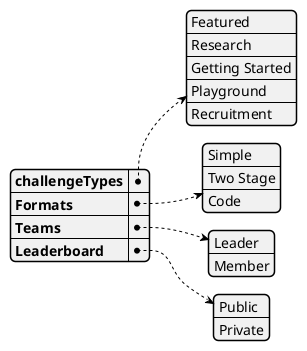

# Kaggle Case Study

Kaggle has four main types of challenges; **Featured**, **Research**, **Getting started** and **Playground**. Featured competition are targeted towards commercial while research challenges are more experimental. Getting started challenge category which is more user-friendly, simple but offer no prizes. Playground is a bit more advanced than Getting started but less complicated than Featured. It offers prizes that "range from kudos to small cash prizes".

  

**Getting started** category has a smaller pool of leader-boards, that way new joiners can compare themselves with less people instead of thousands that may have a score in a certain challenge.

  

>Featured competitions are the types of competitions that Kaggle is probably best known for. These are full-scale machine learning challenges which pose difficult, generally commercially-purposed prediction problems.

Feature challenges also offer prize money that can go up to 1 million dollar and is accessible by anyone.

Kaggle also offers **Recruitment** challenges that are more targeted towards companies to "to build machine learning models for corporation-curated challenges".

>In Recruitment competitions, teams of size one compete to build machine learning models for corporation-curated challenges. At the competition’s close, interested participants can upload their resume for consideration by the host. The prize is (potentially) a job interview at the company or organization hosting the competition.

## Competition Formats

In addition to the different categories of competitions (e.g., “featured”), there are also a handful of different formats competitions are run in.
  

### Simple Competitions
  

In a simple competition, users can access the complete datasets at the beginning of the competition, after accepting the competition’s rules. As a competitor you will download the data, build models on it locally or in [Notebooks](https://www.kaggle.com/notebooks), generate a prediction file, then upload your predictions as a submission on Kaggle. By far most competitions on Kaggle follow this format.
  

### Two-stage Competitions

  
In two-stage competitions the challenge is split into two parts: Stage 1 and Stage 2, with the second stage building on the results teams achieved in Stage 1. Stage 2 involves a new test dataset that is released at the start of the stage.

One example of such a competition is the [Nature Conservancy Fisheries Monitoring Competition](https://www.kaggle.com/c/the-nature-conservancy-fisheries-monitoring).
  

### Code Competitions

  
Some competitions are code competitions. In these competitions all submissions are made from inside of a Kaggle Notebook, and it is not possible to upload submissions to the Competition directly.

These competitions have two attractive features. The competition is more balanced, as all users have the same hardware allowances. And the winning models tend to be far simpler than the winning models in other competitions, as they must be made to run within the compute constraints imposed by the platform.

Hardware restrictions may be implemented for this format.

An example of a code competition is [Quora Insincere Questions Classification](https://www.kaggle.com/c/quora-insincere-questions-classification).

## Joining a Competition

  Each competition in Kaggle has a homepage. This is an example of one.

**Rules**:  This contains the rules that govern your participation in the sponsor’s competition. You must accept the competition’s rules before downloading the data or making any submissions. Users who do not abide by the rules may have their submissions invalidated at the end of the competition or banned from the platform.

**Discussion**: If anything is unclear or you have a question about participating, the competition’s forums are the perfect place to ask.

**Overview**: The information provided in the Overview tabs will vary from Competition to Competition. Five elements which are almost always included and should be reviewed are the “Description,” “Data”, “Evaluation,” “Timeline,” & “Prizes” sections.

The **description** gives an introduction into the competition’s objective and the sponsor’s goal in hosting it.

The **data** tab is where you can download and learn more about the data used in the competition.

The **evaluation** section describes how to format your submission file and how your submissions will be evaluated. 

The **timeline** has detailed information on the competition timeline.

The **prizes** section provides a breakdown of what prizes will be awarded to the winners, if prizes are relevant. This may come in the form of monetary, swag, or other perks. In addition to prizes, competitions may also award ranking points towards the Kaggle progression system. This is shown at the bottom of the Overview page.

Once you have chosen a competition, read and accepted the rules, and made yourself aware of the competition deadlines, you are ready to submit!

## Forming a Team

Everyone that competes in a Competition does so as a team. A team is a group of one or more users who collaborate on the competition. 

Weather you are on a team or not, submissions are limited per team.

**Team Leader**: They are the primary point of contact when we need to communicate with a team, every other person in the team is a Member.

**Team Name**: Anyone in the team can modify the team name by visiting the Team tab.

## Leaderboard

One of the most important aspects of Kaggle Competitions is the Leaderboard:

The Competition leaderboard has two parts.

The **public leaderboard** provides publicly visible submission scores based on a representative sample of the submitted data. This leaderboard is visible throughout the competition.

The **private leaderboard**, by contrast, tracks model performance on data unseen by participants. The private leaderboard thus has final say on whose models are best, and hence, who the winners and losers of the Competition will be.

## Summary

Kaggle competition is aimed more towards machine learning and they have tools to upload data and use online notebooks which are written using python or R language only. They also have additional features:

  * Teams
  * Four challenge types
  * Prizes that range from 'flairs' to large sums of money
  * Leader boards
  * Notebooks; user-friendly way to start coding 
  * Ways for commercial companies to make challenges